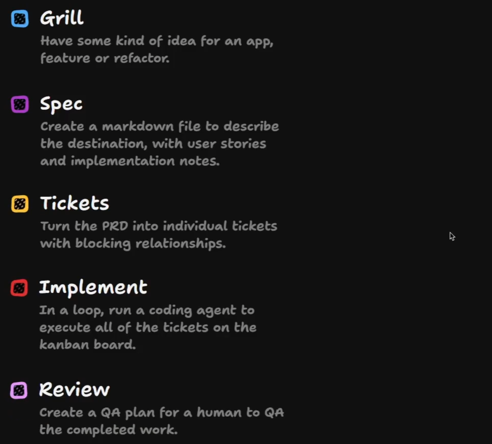
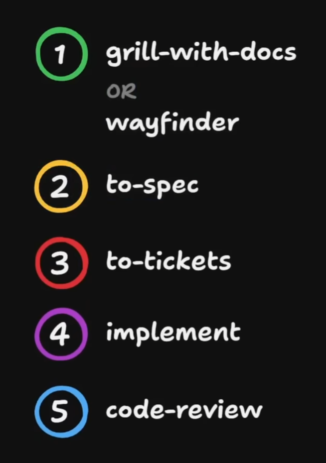

# AI 开发 feature 流程

## 这是什么

这篇不是在定义唯一正确的方法，而是在记录一种我目前觉得很顺的 AI 开发 feature 流程。它更像一个方法论框架：把“从想法到落地”拆成几个稳定阶段，并且在每一阶段都尽量留下可复用的外部产物。

这张图把流程拆成五段：

1. `Grill`
2. `Spec`
3. `Tickets`
4. `Implement`
5. `Review`

我现在更喜欢它的地方，不是名字本身，而是它把“先想清楚，再写清楚，再拆清楚，再做，再验”这条链路明确了出来。

这张图把第一步进一步说清楚了：起点不只是 `grill`，而更像是 `grill-with-docs` 或 `wayfinder`。我很认同这个修正，因为对长期项目来说，单纯问清楚还不够，更重要的是把问出来的结论沉到文档里。

## 为什么这套流程适合 AI 开发

AI 很擅长在局部加速，但如果没有中间产物，它也很容易在需求、边界和验收标准上漂移。

所以这套流程的关键不只是把工作分阶段，而是每一阶段都尽量把结果落到外部环境里：

- 想法不是只停在聊天里。
- 需求不是只存在于某个 session 的上下文里。
- 任务不是靠临场记忆硬撑。
- 验收不是“看起来差不多”。

这也让它和前面仓库里那几篇方法论文能接起来：agent 想稳定，最终还是要靠 environment，而不是只靠某次对话状态。

## 1. Grill-with-docs / Wayfinder：先把模糊想法问清楚并沉成文档

起点通常不是完整需求，而只是一个模糊念头：一个 app、一个 feature、一次重构、一个“也许可以这样”的方向。

这一阶段的目标不是立刻开工，而是先把关键分支问出来，并尽快把结果落到外部文档里，例如：

- 到底要解决什么问题。
- 真正的用户或使用者是谁。
- 哪些边界现在必须定，哪些可以后推。
- 有哪些约束、风险和隐藏假设。

这一段最重要的产物不是代码，而是两样东西：

- 更清晰的问题空间。
- 能被后续继续消费的文档产物。

这里我会把 `wayfinder` 理解成 **更强版本的 grilling**：

- `grilling` 更偏向把问题问清楚。
- `wayfinder` 则不只是追问，还会把结果沉成 map、ticket 和后续可执行入口。

也就是说，`wayfinder` 继承了 grilling 的澄清能力，但再往前多走了一步，把“想清楚”推进成了“写清楚并可继续执行”。

相关参考：

- [grilling 学习拆解](../技能拆解/grilling 学习拆解.md)

## 2. Spec：把目标写成可持续读取的文档

等问题空间逐渐清楚后，就不该继续只靠聊天记录了。`Spec` 阶段要把目标沉成一个 Markdown 文档，至少能回答：

- 这次到底要去哪里。
- 主要用户故事是什么。
- 有哪些实现备注、边界条件和已知取舍。

这里的重点不是追求一开始就写得巨完整，而是把“目的地”固定下来。这样后续换 session、换 agent、换 harness 时，大家仍然能沿着同一个目标继续推进。

## 3. Tickets：把 spec 变成可以执行的工作单元

有了 spec 之后，下一步不是直接让 agent 一把梭实现，而是把它拆成 tickets。

`Tickets` 阶段要做的，是把大目标拆成：

- 单个 ticket 的目标是什么。
- 它依赖谁、会阻塞谁。
- 哪些可以并行，哪些必须串行。

这一步的价值在于，把“一个大而模糊的 feature”变成“一组有边界、有关系的工作单元”。一旦拆好了，后面的实现就更容易被 agent 循环执行，也更容易让人类跟进进度。

## 4. Implement：让 agent 围绕 ticket 循环实现

到了 `Implement` 阶段，AI 才真正进入高频产出期。这里最顺的方式通常不是一句话把整个 feature 全丢给 agent，而是围绕 ticket 做循环：

- 取一个清晰 ticket。
- 实现它。
- 验证它。
- 再进入下一个。

这样做的好处是：

- agent 的上下文负担更小。
- 每次实现的目标更聚焦。
- 出错时更容易定位在某个 ticket，而不是整片需求一起漂。

## 5. Review：把 QA 和验收显式化

最后一段不是“代码写完就完事”，而是 `Review`。图里把它写成“Create a QA plan for a human to QA the completed work”，这一点我很认同。

这里最重要的是：

- 把怎么验写出来。
- 把应该由人判断的部分留给人判断。
- 让完成标准不再只存在于实现者脑中。

如果没有这一步，前面所有阶段都可能在最后退化成“看起来好像差不多”。

## 这五段真正留下的产物

我现在更看重的是每一步会留下什么：

- `Grill-with-docs / Wayfinder` 留下更清楚的问题空间，以及 map、ticket、说明文档等中间产物。
- `Spec` 留下目标文档。
- `Tickets` 留下可执行、可排依赖的工作单元。
- `Implement` 留下代码与实现记录。
- `Review` 留下 QA 方案与验收依据。

这样一来，这套流程就不只是一个操作顺序，更是一条持续建设 external environment 的路径。

## 它和项目级 skill 生命周期的关系

这篇先放在 `AI编程方法论/`，因为我现在更想把它记成“理解 AI feature 开发为什么要分阶段”的方法论框架，而不是已经完全验证好的项目级协作资产。

如果后面你在真实项目里反复用它，而且每一阶段的进入条件、退出条件、产物模板都稳定了，再通过 [`../skills/stable/idea-to-skill/SKILL.md`](../skills/stable/idea-to-skill/SKILL.md) 把它提炼成候选 project-level skill 会更合适。

## 对我的启发

- AI 开发的关键不是只让 agent 快写代码，而是让中间产物持续留下来。
- 真正稳定的 feature 流程，核心是 `Grill-with-docs / Wayfinder -> Spec -> Tickets -> Implement -> Review` 这条链不断把模糊性往外部文档和工作单元里挪。
- 这类流程一旦写清楚，换 session、换模型、换 harness，团队都更容易继续工作。
