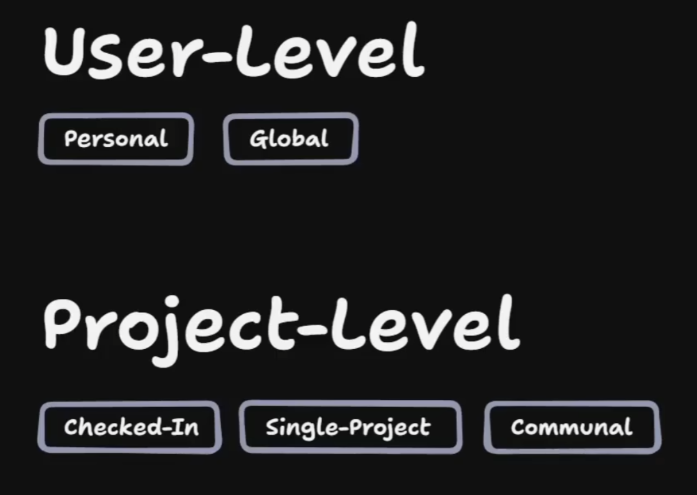

# skill 的作用域与放置

## 这是什么

这篇不是讲某一个具体 skill，而是记录一个更上层的判断：skill 应该放在用户侧，还是放进项目里；以及当 skill 已经带出稳定概念或方法论时，什么时候值得把参考文档和它一起维护。

这张图很适合作为入口：先把视角分成 `user-level` 和 `project-level`，再去细想它更接近哪种放置和维护方式。

## 两层 scope

我现在把 skill 的 scope 先记成两层：

- `user-level`：更像个人装备，主要服务某个用户自己的长期工作方式。
- `project-level`：更像项目协作资产，主要服务这个项目里的参与者。

从学习材料里的划分看，`user-level` 下又能再区分 `personal` 和 `global`，`project-level` 下可以看到 `checked-in`、`single-project`、`communal` 这些形态。对我更重要的不是名字本身，而是它提醒我先判断“谁在用、谁来维护、作用范围多大”。

## 什么时候放在用户侧

更适合放在用户侧的情况：

- 主要是我自己的工作习惯，别人不一定会跟着用。
- 会跨多个项目反复使用。
- 里面带有很强的个人偏好，不适合默认绑进单个项目。
- 即使别人不用，这个 skill 依然完整成立。

这种 skill 更像个人工具箱。它可以是 `personal`，也可以逐步演化成跨项目的 `global` 能力。

## 什么时候放进项目里

更适合放进项目里的情况：

- 这个 skill 服务的是当前项目，而不是某个人的长期偏好。
- 项目参与者都可能会用到它。
- 它需要随着项目结构、术语、约束一起演进。
- 让它被 check in 到仓库里，本身就能降低协作摩擦。

我会把这类 skill 理解成项目资产：既然它属于项目参与者共同使用的能力，就值得放在项目里，让大家一起维护、扩展和升级。

## skill 旁边什么时候该有概念文档

有些 skill 不只是一个执行入口，还会逐渐长出自己的概念、词汇和方法论。到了这个阶段，单个 `SKILL.md` 往往不再适合承载全部内容。

比较适合给 skill 配套同层级参考文档的情况：

- skill 已经形成稳定术语或判断框架。
- 多个人要一起维护它，需要一个更容易讨论和对齐的解释层。
- 这些解释属于“长期参考”，不是每次调用都必须加载的步骤。
- 把它们继续塞进 `SKILL.md` 会增加 context load，削弱真正的执行指令。

这时更稳的做法通常是：

- `SKILL.md` 保持触发条件和执行动作。
- 概念、方法论、边界说明沉到旁边的参考文档。
- 通过清晰的 pointer 把两者连起来。

## 和 invocation 选择的关系

scope 解决“放哪里、谁来维护”，invocation 解决“谁来触发、要不要常驻上下文”。这两个维度不要混在一起。

例如：

- 一个 skill 可以是 `project-level`，但依然设计成 user-invoked。
- 一个 skill 也可以是用户侧的，但因为确实需要自动发现，被做成 model-invoked。

所以判断顺序更像是：

1. 先看 scope：它属于个人，还是属于项目协作资产。
2. 再看 invocation：它该靠人显式触发，还是值得为自动发现持续支付 context load。

## 对我的启发

- “skill 放哪”本身就是架构问题，不只是文件摆放问题。
- 一旦 skill 变成项目协作资产，它就值得被 check in，而不是一直藏在个人目录里。
- `SKILL.md` 不一定要独自承载一切；当概念层已经稳定，给它配一篇参考文档，往往比继续膨胀主文件更健康。
