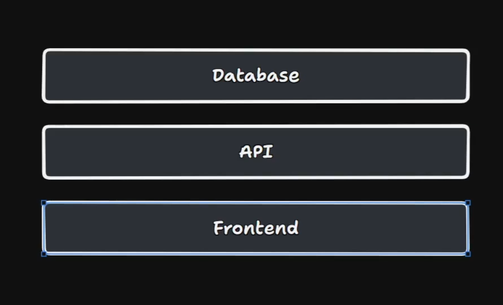
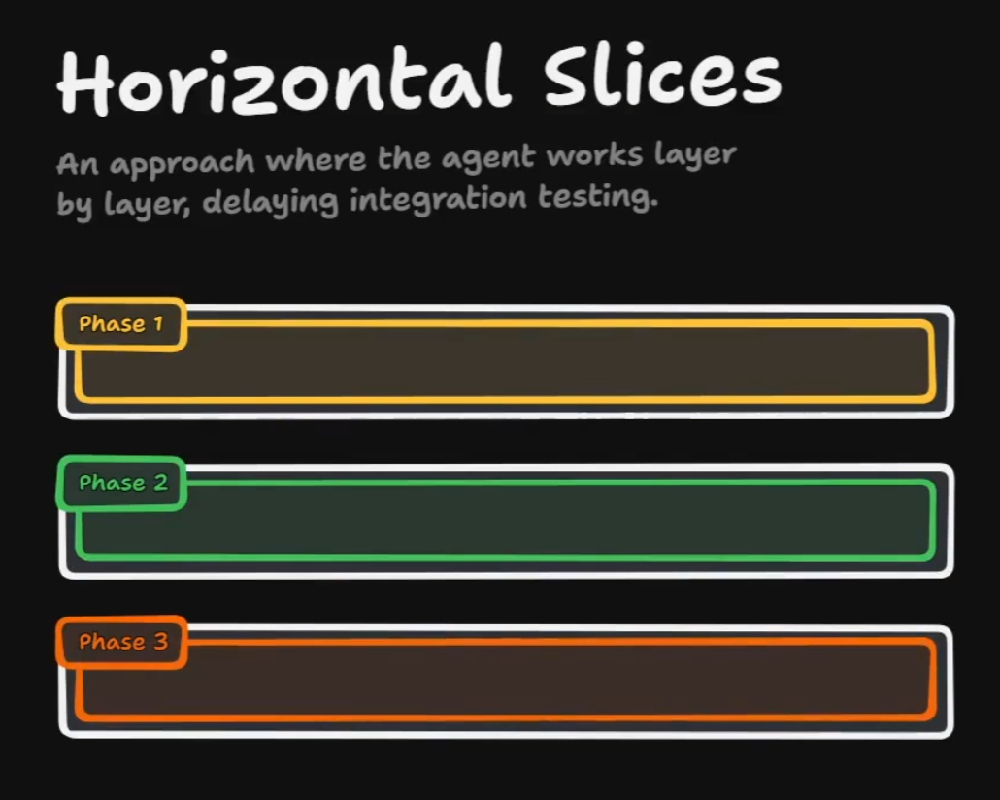
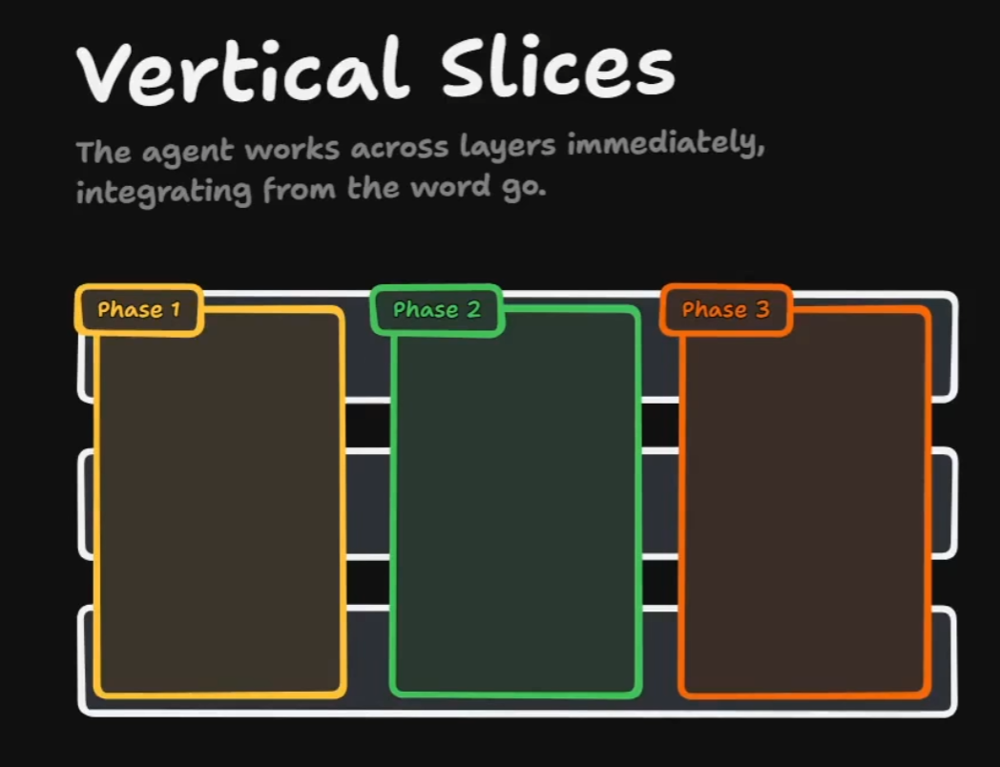

# 任务拆分：纵向切片 vs 横向切片

## 这是什么

这篇想说明一个在 AI 开发里很关键的拆任务原则：**横向拆分很容易变成陷阱，而更稳的默认选择通常是面向功能的纵向切片**。

对 agent 来说，问题往往不在于“会不会写某一层的代码”，而在于它能不能尽早拿到真实反馈。如果任务被按数据库、API、前端这样一层层横着拆，前几个阶段其实都很难知道整体设计是否真的可行。等真正发现问题时，往往已经太晚，返工成本也更高。

## 三张图先建立直觉

先把常见分层看清楚：数据库、API、前端，本来就是不同责任的技术层。

横向拆分的问题在于：Phase 1、Phase 2、Phase 3 往往各自只推进一层，真正的集成被推迟到后面。前面每一阶段都可能写了很多代码，但仍然不知道整体路径是不是通的。

纵向切片更像是从第一阶段开始就跨层工作。每一刀都同时碰到数据库、API、前端，只是范围先做得很小，但它从一开始就是可集成、可运行、可反馈的。

## 为什么横向拆分对 AI 特别危险

横向拆分在人类团队里本来就有集成延迟的问题，放到 AI 开发里，这个问题通常会更明显：

- agent 很容易沿着层次一路写下去，看起来推进很快。
- 但前几阶段拿到的反馈，大多只是“这一层单独看起来还行”。
- 真正关键的问题，例如字段设计是否顺手、接口边界是否合理、前后端是否真的能闭环，要到很后面才暴露。

这就会形成一种很典型的假进展：代码很多，信心也很高，但系统是否真的 work，仍然没有被验证。

## 纵向切片为什么更适合 AI

在 AI 开发里，更好的默认方式通常是让 agent **从第一阶段就跨层工作**：

- 先做一个最小功能。
- 让它同时穿过数据库、API、前端。
- 尽早看到它到底能不能跑通。
- 再在这个最小实现上继续扩展。

这样做的好处很直接：

- 很早就能拿到设计可行性的反馈。
- 很早就能看到各层是怎么集成的。
- 很早就能暴露接口、数据结构、交互路径里的坏设计。
- 后面的迭代是沿着一条已打通的路径扩展，而不是最后再赌整合能成功。

## 这不是“大功能一次做完”，而是“小功能先打通”

纵向切片最容易被误解成“第一刀就把所有层都做很多”。其实不是。

更准确地说，纵向切片强调的是：

- **范围小**
- **路径完整**
- **尽早集成**

也就是先做一个最小、但端到端完整的实现。它也许很薄，但必须是真的活的，而不是几层各自悬空的半成品。

## 和 tracer bullets 的关系

我查了一下，《程序员修炼之道》里明确出现的是 `tracer bullets`，而不是今天更常见的 `vertical slices` 这个词。Pragmatic Bookshelf 在《The Pragmatic Programmer, 20th Anniversary Edition》的 tips 页面里直接列出了 “Use Tracer Bullets to Find the Target”，意思是用 tracer bullets 通过不断试射来逼近目标。citeturn4search0turn4search1

我现在更愿意把两者关系理解成：

- `tracer bullets` 是更早的核心隐喻。
- `vertical slices` 是今天更常见、在任务拆分里更直观的工程说法。
- 把 feature 切成小而完整的纵向路径，本质上就是把 tracer-bullet 思路落到了现代分层系统的任务设计里。

这里最后一条是我的归纳，而不是书里逐字使用的原词。它们的共同点在于：**不要等所有局部都“准备好了”才集成，而要尽早打出一条真实可运行的路径，靠反馈校准方向。**

如果往后看现代工程写法，Martin Fowler 也明确写过，产品更适合通过 `thin vertical slices` 来构建，也就是尽快做出小而完整、可工作的功能路径。这让 `vertical slices` 这套说法和 `tracer bullets` 的精神更容易对上。

## 在 AI feature 流程里应该怎么用

放回到前面那条 `Grill -> Spec -> Tickets -> Implement -> Review` 的链里，纵向切片最适合落在 `Tickets` 和 `Implement` 之间：

- `Spec` 写清目标。
- `Tickets` 不按层切，而按最小可验证功能切。
- `Implement` 让 agent 先打通一个薄但完整的功能路径。
- `Review` 则更早地基于真实集成结果做验收，而不是只验某一层的局部代码。

相关参考：

- [AI 开发 feature 流程](<./AI 开发 feature 流程.md>)

## 一个简单判断法

如果一个 ticket 只是在说：

- “先把数据库层做完”
- “先把 API 全搭出来”
- “先把前端页面都画完”

那它大概率就是横向拆分。

如果一个 ticket 说的是：

- “先打通创建一条记录的最小闭环”
- “先让用户完成一次最基础的提交并看到结果”
- “先跑通一个端到端路径，再逐步补强”

那它更接近纵向切片。

## 对我的启发

- AI 最怕的不是工作量大，而是反馈来得太晚。
- 横向拆分会制造一种“写了很多但还不知道是否可行”的假进展。
- 纵向切片的价值，不只是更快交付，而是更早获得设计、集成和可行性的真实反馈。
