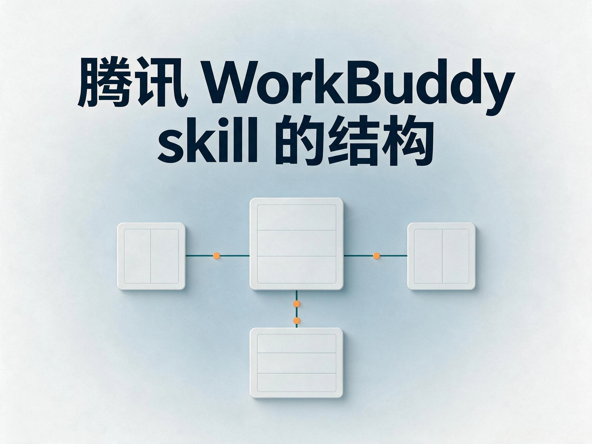
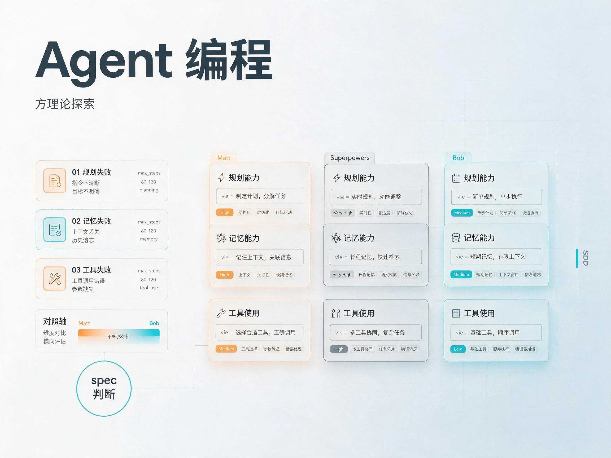
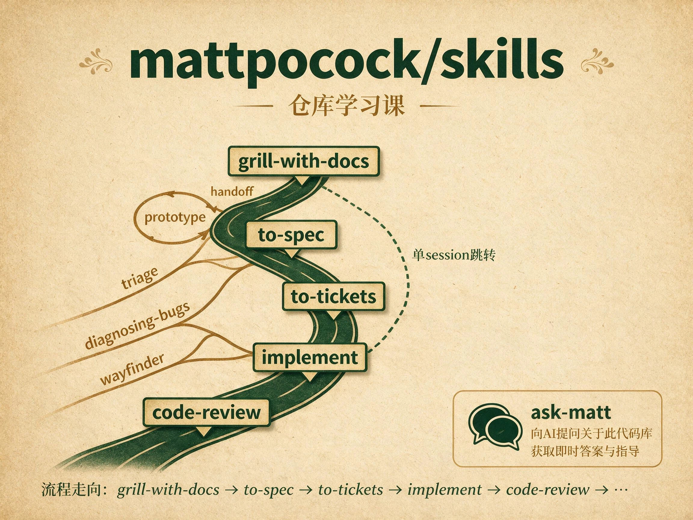

<h1 align="center">AI加油站</h1>

面向 AI 学习沉淀的个人知识库

收藏值得留的入口，写下自己的理解，留下下次还能用的方法。

## 书籍

重读经典软件工程方法论，看看它们今天怎样落到 AI 与 Agent 编程里。完整书单见 [书籍](./书籍/README.md)。

<table>
  <tr>
    <td align="center" width="33.33%" valign="top">
      
      

        <a href="./书籍/人月神话.md"><strong>人月神话</strong></a> 
        别只记住“人月不可互换”，更该看概念完整性、系统产品成本和“没有银弹”的整条主线。
      

    </td>
    <td align="center" width="33.33%" valign="top">
      
      

        <a href="./书籍/软件设计的哲学.md"><strong>软件设计的哲学</strong></a> 
        别把它读成代码风格书，更该盯复杂度到底被消灭了，还是只是被搬到接口和调用方。
      

    </td>
    <td align="center" width="33.33%" valign="top">
      
      

        <a href="./书籍/领域驱动设计.md"><strong>领域驱动设计</strong></a> 
        别把 DDD 读成战术名词表，更该盯统一语言、模型落地与边界上下文这三根主线。
      

    </td>
  </tr>
</table>

## 课程

> clone 到本地后，点封面或标题会打开该课第一份 HTML，也可以进对应课程的 `lessons/` 目录按编号直接打开课件学习。
>
> GitHub 直接查看课程可以在 [这里](https://duoduo369.github.io/ai-gas-station/%E8%AF%BE%E7%A8%8B/) 查看。
>
> 完整课表见 [课程](./课程/README.md)。建议用 Obsidian，打开“文件与连接”里的“检测所有类型文件”；课程目前主要用 [teach-me](https://github.com/duoduo369/teach-me) 这个 skill 生成。

AI 会放大产出，也会放大混乱；这些课更在意怎样少走弯路，而不是怎样多堆几个 prompt。

<table>
  <tr>
    <td align="center" width="33.33%" valign="top">
      
      

        <a href="./课程/teach skill 学习课/lessons/homepage.html"><strong>teach skill 学习课</strong></a> 
        先讲本库常用的 <code>teach-me</code> 覆盖层，再讲上游 <code>/teach</code> 的工作区与调用时机。两节收口。
      

    </td>
    <td align="center" width="33.33%" valign="top">
      
      

        <a href="./课程/腾讯workbuddy技能开发/lessons/homepage.html"><strong>腾讯 WorkBuddy 技能开发</strong></a> 
        先拆 WorkBuddy 官方 skill 结构，再把 <code>writing-for-agents</code> 压上去，最后和 OpenAI Skills、Claude Code Skills 做结构对照。
      

    </td>
    <td align="center" width="33.33%" valign="top">
      
      

        <a href="./课程/agent编程方法论探索/lessons/0001-agent-failure-modes.html"><strong>Agent 编程方法论探索</strong></a> 
        用 Matt / Superpowers / SwarmForge 三套方法讨论纪律落点，也讨论 spec 是入口还是工件。
      

    </td>
  </tr>
  <tr>
    <td align="center" width="33.33%" valign="top">
      
      

        <a href="./课程/AI中文写作去AI味/lessons/0001-ai-flavor-traces.html"><strong>AI 中文写作去 AI 味</strong></a> 
        识别 AI 味的七种痕迹，用六步流程（提示词→材料→大纲→初稿→改稿→定稿）让成品读起来像人写的。两节收口。
      

    </td>
  </tr>
  <tr>
    <td align="center" width="33.33%" valign="top">
      
      

        <a href="./课程/mattpocock-skills 仓库学习课/lessons/homepage.html"><strong>mattpocock/skills 仓库学习课</strong></a> 
        以 <code>mattpocock/skills</code> 为对象，先画仓库地图，再顺着 <code>ask-matt</code> 主流程往下读。
      

    </td>
    <td align="center" width="33.33%" valign="top">
      
      

        <a href="./课程/obra superpowers skill 学习课/lessons/0001-repo-map-and-basic-workflow.html"><strong>Superpowers skill 学习课</strong></a> 
        以 <code>obra/superpowers</code> 为对象，先画出 skills 库、harness 接线和七步工作流的地图，再往下读关键 skill。
      

    </td>
    <td align="center" width="33.33%" valign="top">
      
      

        <a href="./课程/unclebook AI工作流swarmforge仓库学习/lessons/homepage.html"><strong>Uncle Bob SwarmForge 工作流课</strong></a> 
        以 <code>unclebob/swarm-forge</code> 的 <code>swarmforge/</code> 为对象，先分清 main 底座和 pack 流水线，再把 two / four / six 三套 pack 走完。
      

    </td>
  </tr>
</table>
