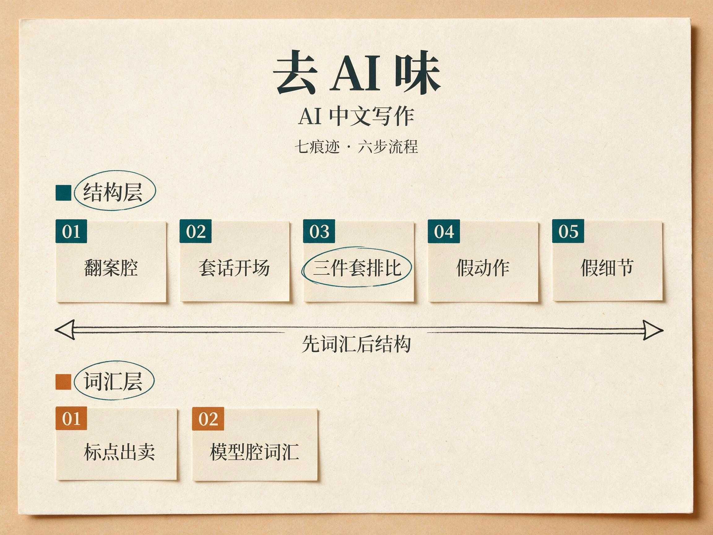

<h1 align="center">AI加油站</h1>

面向 AI 学习沉淀的个人知识库

收藏值得留的入口，写下自己的理解，留下下次还能用的方法。

## 现在这套结构怎么分

- [skills](./skills/README.md) - 项目级 skills 生命周期入口；新的候选 skill 先走 `in-process`，稳定后进 `stable`
- [技能拆解](./技能拆解/README.md) - 外部 skill 与 skill 仓库的学习、拆解、实践与复盘

## 课程

clone 到本地后，点封面或标题会打开该课第一份 HTML。也可以进对应课程的 `lessons/` 目录，按编号直接打开课件学习。

每门课都有：

- `lessons/`：按课时排的 HTML 课件
- `reference/`：回看用的速查页

完整课表见 [课程](./课程/README.md)。建议用 Obsidian，打开“文件与连接”里的“检测所有类型文件”，就可以在课程目录下直接找到各课 `lessons/` 子目录里的 HTML 打开学习。课程目前主要用 [teach-me](https://github.com/duoduo369/teach-me) 这个 skill 生成；它是在 Matt 的 teach 基础上做了中文环境适配，调整了写作口吻，也会按需要配少量图片，降低课程的阅读和理解成本。

## Skill 精读课

<table>
  <tr>
    <td align="center" width="50%" valign="top">
      
      

        <a href="./课程/teach skill 学习课/lessons/0001-teach-workspace-and-how-to-invoke.html"><strong>teach skill 学习课</strong></a> 
        用 <code>/teach</code> 学 teach 本身：工作区七件套、何时调用、本库 <code>teach-me</code> 覆盖层。一节课收口。
      

    </td>
    <td width="50%"></td>
  </tr>
</table>

## 方法论讨论课

<table>
  <tr>
    <td align="center" width="50%" valign="top">
      
      

        <a href="./课程/agent编程方法论探索/lessons/0001-agent-failure-modes.html"><strong>Agent 编程方法论探索</strong></a> 
        用 Matt / Superpowers / SwarmForge 三套方法讨论纪律落点，也讨论 spec 是入口还是工件。
      

    </td>
    <td align="center" width="50%" valign="top">
      
      

        <a href="./课程/AI中文写作去AI味/lessons/0001-ai-flavor-traces.html"><strong>AI 中文写作去 AI 味</strong></a> 
        识别 AI 味的七种痕迹，用六步流程（提示词→材料→大纲→初稿→改稿→定稿）让成品读起来像人写的。两节收口。
      

    </td>
  </tr>
</table>

## 项目拆解课

<table>
  <tr>
    <td align="center" width="50%" valign="top">
      
      

        <a href="./课程/mattpocock-skills 仓库学习课/lessons/homepage.html"><strong>mattpocock/skills 仓库学习课</strong></a> 
        以 <code>mattpocock/skills</code> 为对象，先画仓库地图，再顺着 <code>ask-matt</code> 主流程往下读。
      

    </td>
    <td align="center" width="50%" valign="top">
      
      

        <a href="./课程/obra superpowers skill 学习课/lessons/0001-repo-map-and-basic-workflow.html"><strong>Superpowers skill 学习课</strong></a> 
        以 <code>obra/superpowers</code> 为对象，先画出 skills 库、harness 接线和七步工作流的地图，再往下读关键 skill。
      

    </td>
  </tr>
  <tr>
    <td align="center" width="50%" valign="top">
      
      

        <a href="./课程/unclebook AI工作流swarmforge仓库学习/lessons/homepage.html"><strong>Uncle Bob SwarmForge 工作流课</strong></a> 
        以 <code>unclebob/swarm-forge</code> 的 <code>swarmforge/</code> 为对象，先分清 main 底座和 pack 流水线，再把 two / four / six 三套 pack 走完。
      

    </td>
    <td width="50%"></td>
  </tr>
</table>

## 其他收录

- [书籍](./书籍/README.md) - 书的索引与单本笔记
- [演讲](./演讲/README.md) - 演讲、分享、播客
- [skills](./skills/README.md) - 项目级 skills 生命周期与调用入口
- [技能拆解](./技能拆解/README.md) - 外部 agent skills 的学习、拆解与实践
- [概念](./概念/README.md) - 术语与机制解释
