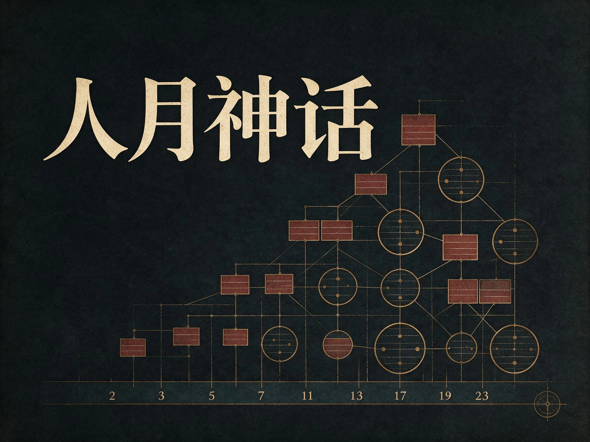
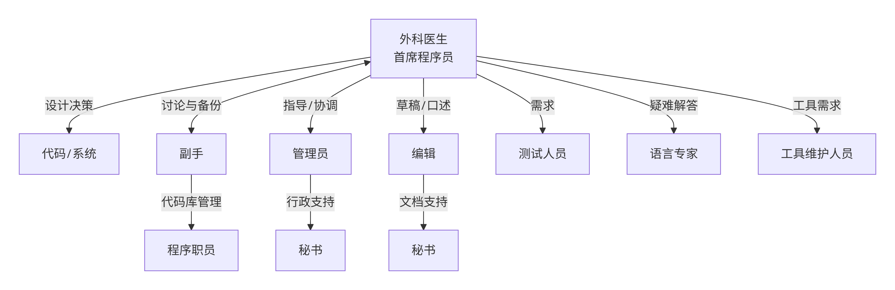

# 人月神话

- 作者：Frederick P. Brooks Jr.（弗雷德里克·布鲁克斯）
- 版本：Anniversary Edition, 2nd Edition（1995）
- 原始入口：[The Mythical Man-Month: Essays on Software Engineering](https://www.informit.com/store/mythical-man-month-essays-on-software-engineering-anniversary-9780201835953)
- 回到索引：[书籍](./README.md)

## 个人阅读记录

> ！AI不要修改阅读记录这里的内容

### 职业的快乐

- 创建事务的纯粹快乐。如同小孩在玩泥巴时感受到的快乐一样，成年人喜欢创造事物，特别是自己进行设计，我想这种快乐是上帝创造世界的折射，一种呈现在每片独特崭新的树叶和雪花上的喜悦。
- 开发出对他人有用的东西。内心深处我们期望我们的劳动成果能被他人使用，并且对他们有所帮助。
- 快乐来自于整个过程体现出的一种强大魅力。将相互啮合的齿轮组装在一起，看到它们以精妙的方式运行着，并收到了预先所期望的效果。比起弹球游戏机或自动电唱机所具有的迷人魅力，程序化的计算机毫不逊色。
- 这种快乐是持续学习的快乐，它来自于这项工作的非重复性特点，人们所面临的问题总有这样那样的不同，因而解决问题的人可以从中学到新鲜的事物，有时是实践上的，有时是理论上的，或者兼而有之。
- 最后这种快乐还来自于易于驾驭的介质上工作，程序员就像诗人一样，几乎是仅仅工作，在单纯的思考中，程序员凭空的运用自己的想象来创建自己的城堡，很少有创造介质如此灵活，如此易于精炼和重建，如此容易实现概念上的设想。

### 人月神话，多年实践确实是这样，加人未必能显著缩短工期

软件工程里并不是多加几个人，项目时间就会大幅下降。人数在某个范围内也许能补产能，但一旦超过阈值，新增成员带来的不只是更多人手，还会带来更重的协调负担。

- 人与人之间的沟通成本会明显上升。分工越细、参与者越多，接口对齐、信息同步、进度确认和返工讨论都会一起增加。
- 新人的学习成本经常被低估。新人不是一加入就能立刻产出，他们要先理解代码、上下文、历史决策和协作方式，而老成员还要分出时间带人。

这点放到远程团队里尤其严重。远程协作沟通上，天然缺少线下那种低成本、即时性的口头确认，很多原本几分钟能说清的问题，会变成消息往返、会议排期、文档补充和等待回复。团队一旦过了某个沟通阈值，误解、延迟和上下文丢失都会被进一步放大。

### 外科手术团队里似乎映射到当前的Agent

Harlan Mills建议的这些职责来看，看起来Agent可以有相同的模式

* 外科医生，也就是真正控制agent运行的人，全知全能，尤其是需要他统筹、设计、定义功能、程序设计
* 副手：外科医生会试图跟他沟通设计，他的主要作用是设计的思考者、讨论者和评估员，他需要详细了解所有代码。其实也就是开始项目遇到的第一个agent，即需求对接agent，无论是用wayfinder还是grilling，需要探索第一波代码，根据用户的意图来跟用户讨论清楚具体的需求，做到对齐。
* 编辑、和文秘：负责产生文档，对应到agent就是to-spec和to-ticket
* 程序员：负责编码。也就是implement负责实现ticket的agent
* 测试人员：QA和code review的agent，来验证代码
* 工具维护人员：也就是负责产出类似各种skill，测试脚本等额外内容的功能

## 对当下 Agent 编程的启发

### 已验证的启发

- **多开几个 agent，不会自动把工期按“人数”线性压缩。**
  Brooks 反对的是把软件项目当成可随意切块的人月账本；OpenAI 现在给的 agent 入口也不是“堆更多 agent”，而是先定义模型、工具、状态与编排这些可组合原语。放到今天看，这个提醒仍然有效：agent 数量本身不是产能，清楚的任务切分、上下文边界和编排方式才是。
  出处：[The Mythical Man-Month](https://www.informit.com/store/mythical-man-month-essays-on-software-engineering-anniversary-9780201835953)、[Building agents](https://developers.openai.com/tracks/building-agents)

- **概念完整性在 agent 协作里，更像先收拢术语、边界和验收口径，再把实现分出去。**
  Brooks 在意的不是“有没有更多人参与”，而是系统最后是不是还像同一个头脑设计出来的。换到今天，这更像要求我们先把领域词汇、边界、验收标准和关键约束收拢成稳定输入，再让不同 agent 去实现、测试和 review。否则 agent 越多，只会越快地产生概念漂移。
  出处：[The Mythical Man-Month](https://www.informit.com/store/mythical-man-month-essays-on-software-engineering-anniversary-9780201835953)、[Building agents](https://developers.openai.com/tracks/building-agents)

- **概念完整性在今天更像“先有一个聚焦 specialist，再决定何时 handoff”。**
  OpenAI 的 Agents SDK 明确建议先从一个 focused agent 开始，把 instructions、tools、handoffs 和 output type 绑定在一个清楚 specialist 上；复杂度上来以后，再继续到 orchestration、handoffs 和 human review。这个顺序和《人月神话》非常契合，因为它默认先保一个清楚的责任中心，再谈如何扩展协作面。
  出处：[Agent definitions](https://developers.openai.com/api/docs/guides/agents/define-agents)、[Agents SDK](https://developers.openai.com/api/docs/guides/agents)

- **Agent 一旦能做写操作，就必须补 guardrails 和 human review。**
  Brooks 反复讲坏消息、测试、里程碑和控制点，不是在崇拜流程，而是在给复杂项目找稳定的停顿点。现在 OpenAI 也把 guardrails 和 human review 当成 agent 工作流里的正式能力，用来定义何时继续、暂停或停止，以及哪些敏感动作必须过人。对今天的代码 agent 来说，这就是“别让自动化一路滑过去”的现代版本。
  出处：[Guardrails and human review](https://developers.openai.com/api/docs/guides/agents/guardrails-approvals)、[Safety in building agents](https://developers.openai.com/api/docs/guides/agent-builder-safety)

### 可能仍有价值的推断

- 如果把 agent 当成长期队友来用，那么 Brooks 说的项目手册、架构手册和少量关键文档，今天很可能对应 `CONTEXT.md`、ADR、tool schema、验收标准和持久化任务状态。
- 生成式 AI 很像 Brooks 语境里那类能大幅削减偶发复杂度的工具，但它并不会自动替团队解决需求定义、边界划分和概念完整性这类本质复杂度。
- “第二个系统效应” 在 AI 时代可能更危险，因为当实现成本突然下降时，人更容易在重写或平台化时把所有历史愿望一起塞回系统。

## 导读

这本书最容易被记成一句口号：迟到的项目再加人，会更晚。那句话当然重要，但它不是全书的全部。《人月神话》真正要处理的是另一层东西：软件项目为什么总在“看起来已经有很多人、很多进度、很多流程”的情况下，还是不断变慢、变乱、变得没人敢改。

Brooks 给出的答案并不神秘。他把问题拆成了三层。第一层是协作成本，软件任务里有大量不能随便并行的理解、学习和对齐，所以人一多，沟通和带教就会反噬进度。第二层是概念完整性，系统如果不是像同一个头脑设计出来的，功能越多，用户感受到的往往不是丰富，而是混乱。第三层是本质复杂度，工具、语言、流程和今天的 AI 都能消掉很多偶发麻烦，但不会把需求、规则、状态和边界这些硬问题一起带走。

今天最容易读偏的地方有三个。第一，把它读成一本“项目经理劝你少招人”的书。第二，把外科手术团队读成小团队崇拜，忘了它谈的是概念权如何集中，而不是团队永远越小越好。第三，只记住“没有银弹”，却把它误听成“新工具都没用”。这三种读法都会把书读窄。

它今天仍然值得读，不是因为 1970 年代的组织图还能原封不动照搬，而是因为远程协作、多仓库系统、平台团队和代码 agent 都把 Brooks 当年看到的几类问题重新放大了。多人协作时，坏消息仍然会被延后；产品边界一乱，生成速度越快，返工越快；实现能力一旦暴涨，人就更容易误以为概念问题也一起解决了。

第一次读，我建议先抓四根线：

1. `程序 -> 编程产品 -> 编程系统产品`：先看为什么“能跑”离“可交付”还有巨大距离。
2. `人月神话 -> 沟通与带教成本`：把 Brooks Law 读成协作结构判断，不要读成简单反加人。
3. `概念完整性 -> 外科手术团队`：盯住谁在决定系统是什么，谁在放大这个决定。
4. `没有银弹`：把它和前面的组织、设计、测试章节连起来看，不要孤立地把它当成技术 pessimism。

### 按章导读

| 章节 | 建议 | 原因 | 与今天的关系 |
| --- | --- | --- | --- |
| 第 1-2 章 | 慢读 | 先把“程序”和“系统产品”的差别、以及人月为什么不成立读扎实。 | 很适合对照今天“代码已经写出来了，怎么还没完”的常见错觉。 |
| 第 3-7 章 | 精读 | 这几章在讲概念完整性、组织设计、规格传递和沟通失真，是全书真正的硬骨架。 | 对多 agent 协作、spec review、手册和知识沉淀特别有启发。 |
| 第 8-15 章 | 带着项目经验读 | 估算、里程碑、测试、文档和集成这些话题，单看很散，放回项目经验里会很准。 | 这部分能帮你看清很多延期不是编码慢，而是测试、返工和坏消息积出来的。 |
| 第 16-17 章 | 必读 | “没有银弹”是 Brooks 对软件复杂度的总判断，但要和前文一起看才不会误解。 | 今天读这里，最容易顺手拿来校准对 AI 能力边界的期待。 |
| 第 18-19 章 | 选读但很值得 | 这是作者 20 年后对自己前面判断的回看，能帮你区分哪些是硬结论，哪些是程度修正。 | 很适合今天读，因为它直接处理“老书哪些还成立”这个问题。 |

如果你只想先建立一个不跑偏的阅读姿势，我会建议把这本书当成一份复杂软件协作的失败复盘，而不是金句集。先读懂它在反对什么，再读它在保护什么。它反对的是把软件当成可线性堆人的施工现场，保护的是概念完整性、真实里程碑、可传递的规格和对复杂度的诚实。把这几根线抓住，这本书就不会只剩“人月不可互换”这一句了。
