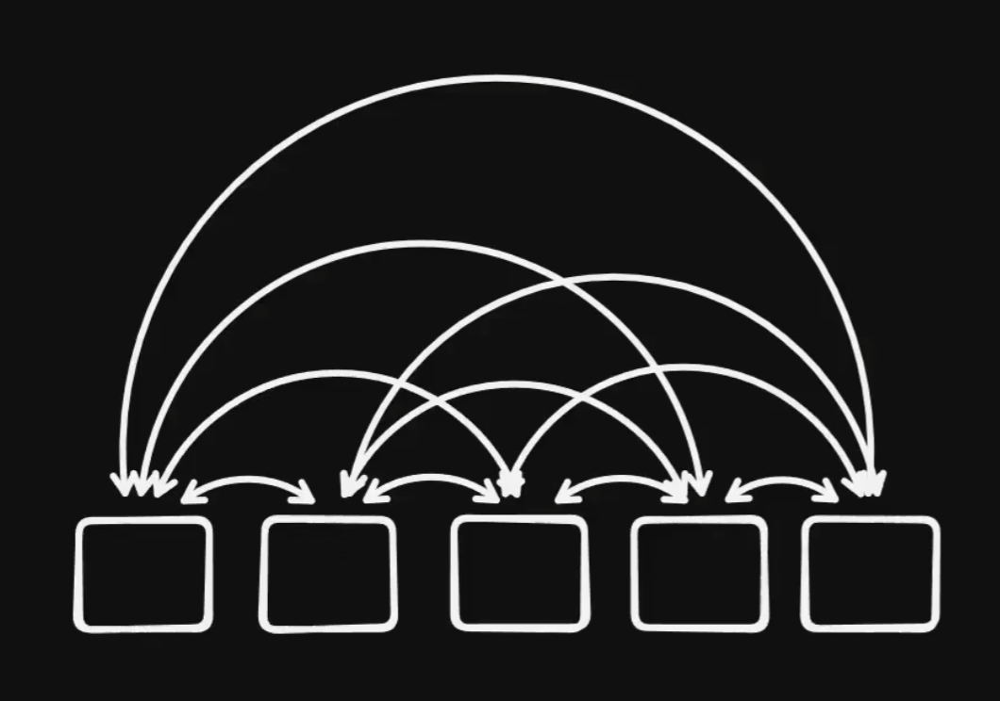
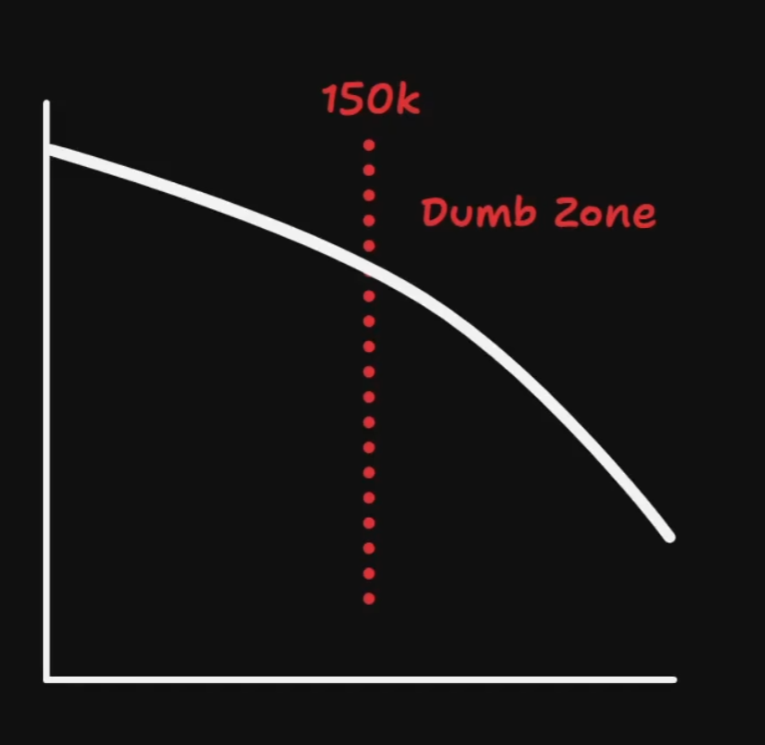

# session 的 scope 与 dumb zone

## 这是什么

这篇想解释一个很实用但经常被忽略的概念：`session` 不是一个无限变长也不会变质的工作空间。随着上下文持续累积，模型在同一个 session 里的表现通常会经历一个从稳定到发散的变化过程。为了便于理解，我先把它记成两个区域：

- `smart zone`：上下文还紧凑、主线还清晰、模型表现相对稳定的区域。
- `dumb zone`：上下文长到一定程度后，模型开始显得分心、飘、怪，输出质量明显下滑的区域。

## 两张图先建立直觉

这张图适合用来理解为什么上下文一长，问题不只是“字变多了”。每增加一段输入，模型都需要在更多 token 之间维持关系；长度越大，潜在关系就越多，注意力也越容易被摊薄。

这张图更像是工作感受层面的总结：session 不是到了某个固定数值才突然坏掉，而是随着上下文增长，表现逐渐下滑，然后进入一个明显更难控制的区域。图里的 `150k` 更适合理解成示意，不是所有模型都共享的硬阈值。

## session 为什么会有 scope

模型对你没有跨 session 的长期记忆。你在当前 session 里通过需求描述、来回澄清、`grilling` 一类追问，把目标、约束、偏好和上下文一点点喂进去，它才逐渐形成“这次到底在做什么”的工作视角。

所以 session 的 scope 不是“这个窗口最多能装多少字”，而是：

- 当前主线任务是什么；
- 为了完成这条主线，哪些上下文还值得继续留在窗口里；
- 哪些新问题一旦塞进来，会开始污染这条主线。

这也是为什么 session 前半段通常很宝贵。那一段上下文不是噪音，而是后续很多判断的地基。

## smart zone 为什么宝贵

在 `smart zone` 里，模型通常还保有三种能力：

- 主线感比较强，知道当前最重要的任务是什么。
- 约束感比较强，记得你前面强调过的边界和偏好。
- 推进感比较强，不容易被次要信息带偏。

这也是为什么在同一个 session 里，最好优先把一条主要工作流做穿。上下文越集中，模型越容易持续站在同一个问题空间里思考。

## dumb zone 是怎么来的

进入 `dumb zone` 并不一定是因为某一句话写错了，而更像是上下文整体变得太长、太杂、太多线程。常见表现会包括：

- 明明前面说过的约束，后面开始忘。
- 回答变得很像“看起来对，但其实没抓住重点”。
- 会突然执着于次要细节，或者莫名其妙切换问题框架。
- 对同一问题前后口径变得不稳定。

背后的直觉是：模型本质上是在根据已有输入推断“下一个最可能、也最有用的输出 token”。当输入越来越长、token 之间要兼顾的关系越来越多时，它的注意力就更容易被分散，主线也更容易被稀释。

## session 维护为什么重要

如果把 session 当成无限大的垃圾场来堆内容，最后坏掉的不是“窗口长度”本身，而是当前工作的可控性。

所以 session 维护更像是在做上下文预算管理：

- 让当前 session 尽量只服务一条主线。
- 该压缩时压缩，减少重复历史对窗口的占用。
- 该切 session 时切 session，不让临时插入的问题把主线任务污染掉。

## 两种常见处理手法

### 1. 还在同一条主线里，就优先压缩

如果你做的还是同一件事，只是历史已经太长，就更适合用 harness 自带的上下文压缩能力，把冗长历史收敛成更紧的工作摘要。

这类做法适合：

- 主线任务没有变。
- 前面沉淀的上下文仍然有价值。
- 问题在于“太长”，而不是“话题已经切掉了”。

### 2. 主线被打断了，就 handoff 后开新 session

如果当前 session 正在推进一条主要工作流，突然又插进来一个修 bug、查问题、临时分支任务，更稳的做法通常不是把它们硬塞在一起，而是先把当前上下文落成一个 handoff 文档，再开一个新 session 去处理插入任务。

可以把 `handoff` 理解成把当前窗口里的有效上下文转存为一个更干净的 Markdown 资产，供下一个 session 继续使用，而不是强迫同一个窗口同时维护两条不相干的主线。

相关参考：

- [handoff 学习拆解](../skills/handoff 学习拆解.md)
- [grilling 学习拆解](../skills/grilling 学习拆解.md)

## 一个简单判断法

我现在更倾向用这个判断：

- 还是同一条主线，只是上下文太肥了：压缩当前 session。
- 任务已经切换，或者插入任务会污染主线：handoff 当前上下文，然后开新 session。
- 如果新问题之后还要回到旧主线，更应该把旧主线先落成文档，而不是赌自己能在一个臃肿 session 里同时维持两套上下文。

## 对我的启发

- session 的价值不只是“能聊很久”，而是“能在一段时间内稳定维持同一条主线”。
- `smart zone` 是稀缺工作区，不应该被随手插入的杂线任务消耗掉。
- `handoff` 不只是交接技巧，也是一种 session 卫生机制。
