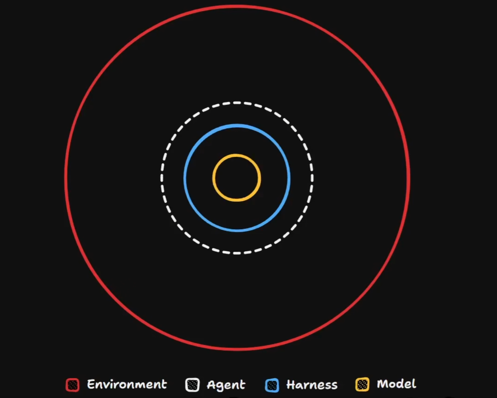
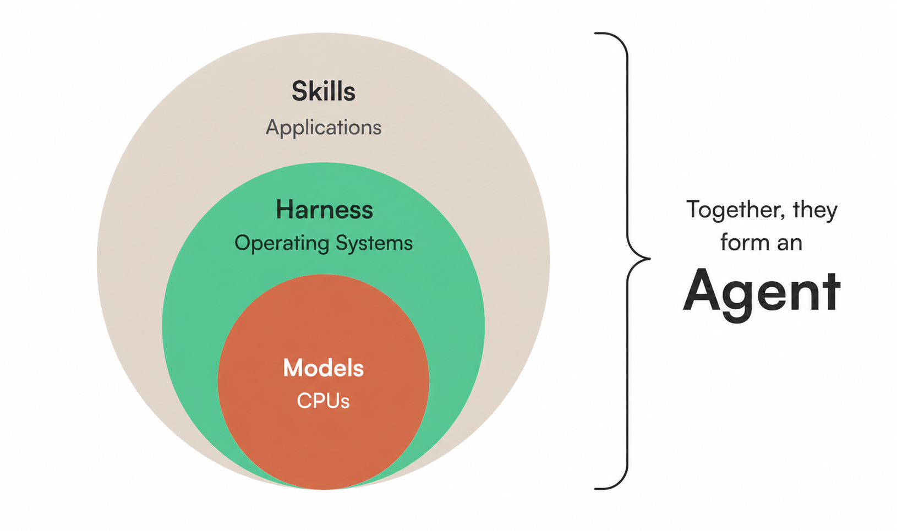

# 什么是 agent

## 这是什么

很多人会把 agent 先粗略理解成 `model + harness`。这个理解不算错，但如果放到真实工程协作里，我现在更愿意把它记成：

`agent = model + harness + external environment`

也就是：

- `model`：负责生成、推断、补全与推理的核心模型能力。
- `harness`：把模型接进可执行工作流的壳层，包括工具调用、会话管理、文件操作、命令执行、skill 机制等。
- `external environment`：让 agent 在多个 session、多人协作、长期项目里还能稳定工作的外部环境，包括项目文档、约定、流程、验收机制和持久化产物。

## 两张图先建立直觉

这张图很适合表达我现在更认同的层次关系：`model` 在最内层，`harness` 包住模型，而真正让 agent 能在工程里长期可用的，是更外层的 `environment`。

这张图更接近很多人最先接受的说法：模型在最里面，外面是 harness，再往外是 skills / applications，它们合起来形成 agent。这个视角本身没问题，但如果只停在这里，会低估项目外部环境的重要性。

## 为什么说 `model + harness` 还不够

如果只看单次 session，`model + harness` 往往已经能解释很多现象：

- 模型负责理解和生成。
- harness 负责给模型接工具、接文件系统、接命令执行能力。
- skill 则像 harness 之上的可复用工作套路。

但真正到了工程协作里，你很快会遇到另一个问题：agent 的短期工作记忆很强，可它并不自带跨 session 的稳定状态。

也就是说：

- 在同一个 session 里，它可以显得非常懂你当前项目。
- 一旦换了新 session，这种理解就不会自动保留下来。

这时真正承担“持久化项目理解”的，往往不是 model，也不是 harness，而是外部环境。

## external environment 到底包含什么

这里说的 `external environment`，不是只指操作系统或终端环境，而是更广义的工程外部环境，包括：

- 项目的目录结构与可发现入口。
- 需求分析文档、设计记录、handoff 文档。
- 代码生成后的验收流程与质量门槛。
- 协作约定、命名规则、路由规则。
- 让新人、换模型、换 harness 后仍能继续工作的持久化资产。

在这个仓库里，很多东西都属于 environment 的一部分，例如：

- [AGENTS.md](../AGENTS.md)
- [CONTEXT.md](../CONTEXT.md)
- [docs/wayfinder/MAP.md](../docs/wayfinder/MAP.md)
- [handoff 学习拆解](../skills/handoff 学习拆解.md)

像 `superpowers`、`wayfinder`、`handoff` 这一类方法或 skill，真正解决的也不只是“让模型更会写”，而是帮助团队把关键上下文和工作约束沉到环境里。

## 为什么 environment 在工程上更关键

从最近这段时间的工程体验看，让 agent 稳定可用，越来越不只是“选一个最强模型”的问题。

我更认同的判断是：

- model 当然重要，但它已经不再是唯一决定性因素。
- harness 很重要，因为它决定了工具能力、交互效率和执行手感。
- environment 往往更关键，因为它决定了项目知识能不能被持久化、共享、迁移和复用。

如果 environment 没有维护好，就很容易出现这些问题：

- 换一个 model，项目上下文就丢一半。
- 换一个 harness，原来的工作流就断掉。
- 换一台电脑、换一个操作系统、换一个订阅，团队协作就重新磨合。

反过来，如果 environment 维护得好，即使你在 `codex`、`claude`、`cursor`、别的 shell harness 之间切换，团队成员仍然可以沿着同一套项目入口和约束继续工作。

## agent 为什么看起来“记性很好”，却又“不真正记得”

这是最容易让人误判的地方。

在单个 session 里，agent 往往表现得像有很强短期记忆，因为它能持续利用这段窗口中的上下文来推断你的目标、偏好和当前约束。

但它的这种“记得”，更准确地说是：

- 它正在读取当前窗口里的上下文。
- 不是它在别的 session 里保留了稳定状态。

所以一旦 session 结束，或者换到另一个新窗口，真正能把工作上下文接过去的，就只能靠 environment 中已经被写下来的东西。

相关参考：

- [session 的 scope 与 dumb zone](<./session 的 scope 与 dumb zone.md>)

## 对项目维护的启发

如果把 agent 当成 `model + harness + environment`，那团队真正该投精力的地方也会变化：

- 不只是追最新模型。
- 不只是追最好用的 harness。
- 更要持续建设项目的外部环境，让上下文能留下来、让流程能迁移、让协作能复制。

换句话说，agent 的稳定性，很多时候不是“模型够不够聪明”决定的，而是“环境够不够可继承、可发现、可协作”决定的。

## 对我的启发

- `agent = model + harness + environment` 比 `model + harness` 更适合解释真实工程协作。
- session 内的强表现，不等于跨 session 的真实记忆。
- 真正能抗模型切换、工具切换和人员切换的，是项目环境，而不是某一次幸运的会话状态。
