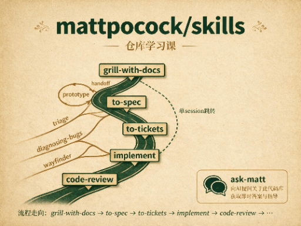

# 课程

多课时、可以独立回看的课程包。clone 到本地后，进对应课程的 `lessons/` 目录，用浏览器按编号打开 HTML 就能学。

每门课都有：

- `lessons/`：按课时排的 HTML 课件
- `reference/`：回看用的速查页

点封面或标题会打开该课第一份 HTML。

## 方法论讨论课

<table>
  <tr>
    <td align="center" width="50%" valign="top">
      
      

        <a href="./agent编程方法论探索/lessons/0001-agent-failure-modes.html"><strong>Agent 编程方法论探索</strong></a> 
        用 Matt / Superpowers / SwarmForge 三套方法讨论纪律落点，也讨论 spec 是入口还是工件。
      

    </td>
    <td width="50%"></td>
  </tr>
</table>

## 项目拆解课

<table>
  <tr>
    <td align="center" width="50%" valign="top">
      
      

        <a href="./mattpocock-skills 仓库学习课/lessons/0001-repo-structure-and-skill-map.html"><strong>mattpocock/skills 仓库学习课</strong></a> 
        以 <code>mattpocock/skills</code> 为对象，先画仓库地图，再顺着 <code>ask-matt</code> 主流程往下读。
      

    </td>
    <td align="center" width="50%" valign="top">
      
      

        <a href="./obra superpowers skill 学习课/lessons/0001-repo-map-and-basic-workflow.html"><strong>Superpowers skill 学习课</strong></a> 
        以 <code>obra/superpowers</code> 为对象，先画出 skills 库、harness 接线和七步工作流的地图，再往下读关键 skill。
      

    </td>
  </tr>
  <tr>
    <td align="center" width="50%" valign="top">
      
      

        <a href="./unclebook AI工作流swarmforge仓库学习/lessons/0001-swarmforge-map.html"><strong>Uncle Bob SwarmForge 工作流课</strong></a> 
        以 <code>unclebob/swarm-forge</code> 的 <code>swarmforge/</code> 为对象，先分清 main 底座和 pack 流水线，再把 two / four / six 三套 pack 走完。
      

    </td>
    <td width="50%"></td>
  </tr>
</table>
