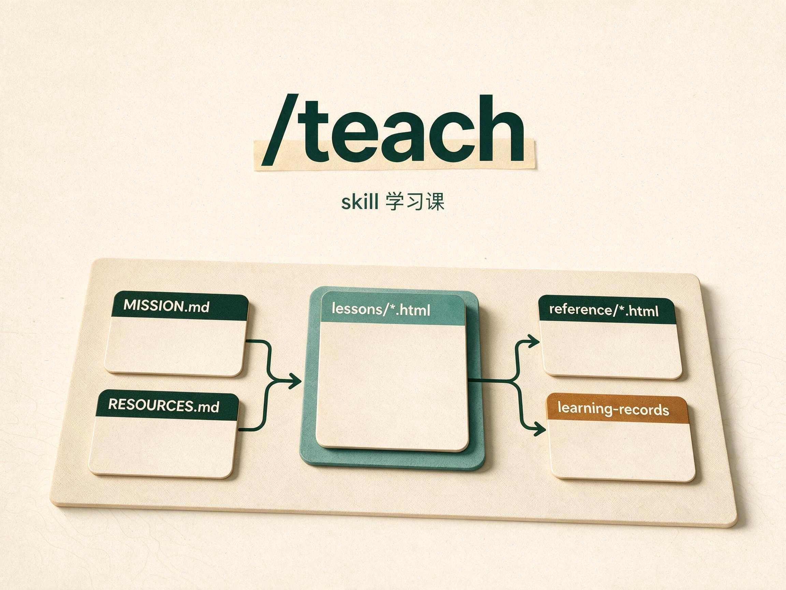

# teach skill 学习课

> 原始 skill：[mattpocock/skills · teach](https://github.com/mattpocock/skills/blob/main/skills/productivity/teach/SKILL.md)
> 人读说明：[docs/productivity/teach.md](https://github.com/mattpocock/skills/blob/main/docs/productivity/teach.md)
> 回到课程索引：[课程/README.md](../README.md)
> 教学状态：[MISSION.md](./MISSION.md) · [RESOURCES.md](./RESOURCES.md)
> 课程首页：[homepage.html](./lessons/homepage.html)

这门课先讲本库常用的 `teach-me` 覆盖层，再回到上游 `/teach`。对象是两张卡的接缝，不是某门编程课的内容。

读完后，你能：

- 先分清 `teach-me` 和 `teach`：前者规定中文 HTML 课程怎么落地，后者规定教学工作区怎么续写
- 判断什么时候该打 `/teach`，什么时候直接问一句就够
- 写出第一句：主题或 GitHub 地址、已知缺口、指定资料、目录落点
- 指认教学工作区里每份文件干什么
- 看出这门课为什么先讲 `teach-me`，再讲 `teach`

课程包沿用 `teach` 的工作区思路，额外保留：

- `MISSION.md`：这门课为什么学
- `RESOURCES.md`：可信资料清单
- `NOTES.md`：教学偏好与工作备注

HTML 课件顶部导航现在按 `teach-me` 的 `nav-guide.md` 对齐成“首页 · lessons / 速查”，不再额外链课程 README；lesson 页底部保留上一课 / 下一课。

## Lessons

- [0001 · 先认清 teach-me：它怎样把课写成中文 HTML](./lessons/0001-teach-me-overlay-and-course-workspace.html) - `teach-me` 相对上游 `teach` 多管哪些事：中文写作、HTML 结构、课内导航、课程目录落点；课内折叠嵌入 `teach-me` 正文和 guide 规则。
- [0002 · 工作区怎么转起来，以及何时打 /teach](./lessons/0002-teach-workspace-and-how-to-invoke.html) - 工作区七件套，以及第一句怎么打：GitHub 仓库、日常技能、钉资料、续课；课内折叠嵌入 `teach` 关键条文。

## Reference

- [teach-me 覆盖层速查](./reference/teach-me-course-overlay-map.html) - 工作流五步、写作 / HTML / 导航约束、本库课程落点。
- [teach 工作区速查](./reference/teach-workspace-map.html) - 分流、第一句怎么打、文件职责、本库落点、常见坑。

## 当前收尾

这门课暂时收在两节：`0001` 先讲 `teach-me` 覆盖层，`0002` 再讲上游 `teach` 的工作区与调用时机。
