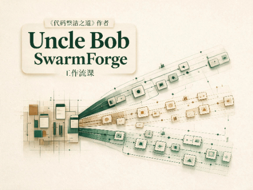

# unclebook AI工作流 swarmforge 仓库学习课

> 原始仓库：[unclebob/swarm-forge](https://github.com/unclebob/swarm-forge)（聚焦 [`swarmforge/`](https://github.com/unclebob/swarm-forge/tree/main/swarmforge)）
> 回到课程索引：[课程/README.md](../README.md)
> 教学状态：[MISSION.md](./MISSION.md) · [RESOURCES.md](./RESOURCES.md)
> 课程首页：[homepage.html](./lessons/homepage.html)

这门课拆 Uncle Bob 的 SwarmForge。你先看清 `main` 上共享的 `swarmforge/` 管什么，再从 two-pack 开始，把一条可运行 pack **整台走完**。交接协议和角色条文跟着 pack 一起看。

课内已经按 [teach 课件加厚方法](../../playbook/teach-课件-嵌入权威中文prompt.md) 把本课要对照的权威正文嵌成中文（原文只留 GitHub 外链）；正文默认折叠，点开即可看完整 prompt，复习时不必再翻上游仓库。

课程包做成自包含结构：

- `lessons/` 放可直接打开的 HTML 课件
- `reference/` 放回看时用的速查页
- `assets/` 放这门课自己的样式和脚本

课件中引用源码的位置走 GitHub 链接，所以这门课被移动到别的电脑时，主资料链接仍然可用。

HTML 课件顶部有相对路径导航：首页、四课互跳、速查页；lesson 页另有上一课 / 下一课。

## Lessons

- [0001 · 先建立 SwarmForge 的地图](./lessons/0001-swarmforge-map.html) - 先看分层地图；嵌共享宪法中文；角色先给一句话，条文留给 0002–0004；术语链 glossary。
- [0002 · 把 two-pack 走完一遍](./lessons/0002-two-pack-complete-loop.html) - 嵌生成指令、`project.prompt`、coder/cleaner 中文；共享三篇法链 0001。
- [0003 · 把 four-pack 走完一遍](./lessons/0003-four-pack-complete-loop.html) - 嵌 four-pack 本地法与四角色中文；共享三篇法链 0001。
- [0004 · 把 six-pack 走完一遍](./lessons/0004-six-pack-complete-loop.html) - 嵌 six-pack 本地法与六角色中文；共享三篇法链 0001。

## Reference

- [SwarmForge 速查地图](./reference/swarmforge-map.html)
- [术语速查](./reference/glossary.html)
- [two-pack 流程速查](./reference/two-pack-flow.html)
- [four-pack 流程速查](./reference/four-pack-flow.html)
- [six-pack 流程速查](./reference/six-pack-flow.html)

## 后续可扩展方向

- Windows / WSL 上实际跑 `get-swarm-forge`
- 对照自己的 AI 流程：哪些闸该偷，哪些 tmux 编排不用抄
